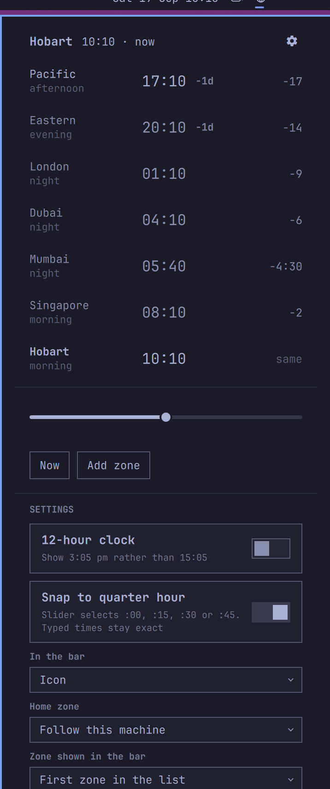

# Zonebar

**Stop doing timezone math.** Every zone you care about, one click from the
Omarchy bar, with the offsets measured from wherever you are.



## What it does

Click the globe in the bar. Every zone you have added is listed with its local
time, how far that is from you, and whether it is a reasonable hour there.

- **Offsets relative to you.** `-14` and `-4:30`, not `UTC-4` and `UTC+5:30`.
  The number you want is the difference between them and you, which is also the
  number you say out loud.
- **Day boundaries.** A zone still on yesterday is marked `-1d`. This is the
  detail people get wrong when booking things.
- **Day and night at a glance.** Each row says `morning`, `afternoon`,
  `evening` or `night`, and rows outside working hours are dimmed, so the
  people you should not be ringing recede.
- **Scrub the whole world.** Drag the slider and every row moves together,
  twelve hours either way. Finding an hour that suits five cities is a drag
  rather than five sums. Right-click the slider, or press **Now**, to snap back.
- **Type a time on any row.** Click a row, type `3pm` or `15:00` or `1500`, and
  everything else re-reads for that moment.
- **Add, remove, reorder.** Changes are written back to your shell config, so
  they survive a restart.

## Install

```bash
omarchy plugin add https://github.com/stbeck11/omarchy-zonebar.git --enable
```

That is all. The widget lands in the centre of the bar with six zones already
set up, and there is nothing to configure unless you want to.

To remove it:

```bash
omarchy plugin remove stbeck11.zonebar
```

## Settings

Everything is optional. Open the widget's settings from the bar, or edit the
entry in `~/.config/omarchy/shell.json`.

| Setting | Default | What it does |
| --- | --- | --- |
| `zones` | six zones, below | Comma-separated IANA names, in panel order. Add `=Label` to any of them to show a name you actually use. |
| `homeZone` | blank | The zone every offset is measured from. Blank follows this machine's clock, which is almost always right. Set it when you are travelling but still think in the timezone you left. |
| `hour12` | `false` | Show `3:05 pm` instead of `15:05`. |
| `snapToQuarterHour` | `false` | Snap the slider to the nearest quarter-hour clock time (`:00`, `:15`, `:30`, `:45`). Typed times stay exact. |
| `barDisplay` | `Icon` | How much space the widget takes before you click it. `Icon`, `Icon and time`, or `Time`. |
| `barZone` | blank | Which zone's time the bar shows when the display includes one. Blank uses the first in your list. |

The defaults are Pacific, Eastern, London, Dubai, Mumbai and Singapore, chosen
to span a working day rather than to be exhaustive.

Enable **Snap to quarter hour** in the widget settings, or add
`"snapToQuarterHour": true` to its bar entry in `shell.json`. For example,
starting at 10:07 and dragging forward 15 minutes selects 10:15. Halfway
values round forward; the ends select the nearest quarter hour inside the
12-hour range. A snapped time stays fixed as the live clock advances. **Now**
or right-clicking the slider or bar icon returns to the live clock.

Editing `zones` by hand is never necessary: adding, removing and reordering
from inside the panel writes the same string back for you.

## How it works

Timezone offsets come from the system's own tzdata, via a small shell helper
that runs `date` under each zone. That means daylight saving, half-hour zones
and whatever the tzdata maintainers changed this year are the operating
system's problem rather than this plugin's.

A zone that is not in the database is shown as unresolved rather than rendered
at UTC. `TZ=Nonsense/Place date` prints `+0000` without complaint, and a clock
that invents a time and presents it confidently is worse than one that admits
it does not know.

The arithmetic lives in `Model.js`, which is Qt-free and covered by tests:

```bash
node --test test/model.test.mjs
```

## Credit

Inspired by [ZoneBar](https://github.com/yazinsai/zonebar) by Yazin Alirhayim,
a menu bar app for macOS and Windows. This is an independent implementation for
the Omarchy shell written from scratch in QML; no code is shared between them.
If you are on a Mac, go and use the original.

## Licence

MIT. See [LICENSE](LICENSE).
